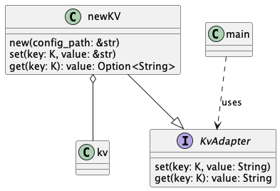

## 仕様
kv crateをラップして任意の型のkeyと任意の型のバリューを渡してkey/value storeとして保管してくれるAdaptorパターンのコード.
クラス図は

単純にget/setだけインターフェースとして用意

実用性はない

## わからない点
Q: K: Key<'a>という表現

A: トレイト境界, Kという型がトレイトKey<'a>を実装している必要がある

Q: Key<'a>ってなに？

A: キーとして使用される型に制約を定義. KeyはBucketのkey部分に該当するため制約を課される

Q: ライフサイクルってこの場合なんで必要？

A: K, Tが参照なら(&str)なら当然参照が有効である期間を指定するために'aを指定する必要がある