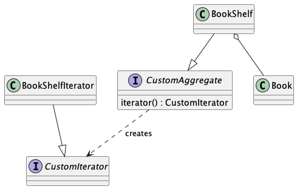

## Iterator patternのクラス図



## dyn <trait>

[これ](https://doc.rust-jp.rs/rust-by-example-ja/trait/dyn.html)がわかりやすかったかも

今回CustomAggregateトレイトで宣言されているiteratorはCustomIteratorのtraitを実装するstructを返す関数としたい。(つまりiterator関数が返す戻り値はiteratorトレイトが実装された型であることを保証したい。)しかしtraitはどのstructが実装されるかでメモリ利用量が違う。Box<trait>とすることでBoxというヒープ領域内のメモリの参照を返すことでコンパイル時のメモリサイズを気にしないようにできる。しかし関数がヒープ内のメモリの参照を指す場合dynキーワードを付けて返す必要がある。

つまりtraitを指定する場合はBox<dyn trait>という形で戻り値の型を指定して上げる必要がある。

### + '_?

出てくる箇所としては

```
fn iterator(&mut self) -> Box<dyn CustomIterator + '_> {
        Box::new(BookShelfIterator::new(self))
}

impl<'a> BookShelfIterator<'a> {
    fn new (bookshelf: &'a mut BookShelf) -> Self {
      ...
    }
}
```

ライフタイムという名前は知ってる。がせいぜい俺のライフタイムの知識はオブジェクトは関数内で生成するとその関数が終了したときにそのオブジェクトも破棄されるくらいのものだ。指定って何だよ

ChatGptくんに聞くと以下のような解説をしてくれる

```
iteratorメソッドが返すBox<dyn CustomIterator>のライフタイムは、selfのライフタイムに依存します。つまり、BookShelfのインスタンスが有効である限り、そのイテレータも有効であることを保証します。
```
今回の場合CustomIterator自体のライフタイムとBookShelfのライフタイムが一緒だと当然Iteratorが保持しているBookShelfにアクセスできるタイミングはライフタイム期間内であると保証される。

対して'_が指定していないと戻り値はstaticライフタイムと推測される。

newで作成されるBookShelfIteratorは&'a mutという'aのライフタイムを持つデータを返すのでstaticでのライフタイムより短いため指定するライフタイムを保証できないためコンパイルエラーがでる。

またライフタイム '_を指定しない場合staticとなる。大抵のオブジェクトのライフタイムはstaticより短いためstaticを保証しようぜ

## 構造体が可変参照を保持する場合にライフタイム注釈つつけなければ行けない理由
`struct BookShelfIterator{}`は所有権を持つ。上か書かれているようにBookShelfIteraorが持つBookshelfはデータを独立して持たないといけない。(cloneとか完全コピーをしないとだめ)
今回の場合ライフタイム参照を利用しない場合、selfのコピーを用意してiteratorを渡さなければならない。
その場合またそのコピーしたオブジェクトもライフタイムを管理しないと行けない。

対して`struct BookShelfIterator<'a> {}`はライフタイム`'a`で管理されているため、借用された参照(&)データを保持できる

所有権は他のオブジェクトに渡す際にちゃんとコピーしないとだめだけど参照は気にしなくても良いしかし元データの生存期間を気にしてライフタイム注釈を入れてコンパイラに渡したデータはちゃんと渡された構造体からアクセスできるよということを保証してあげないとだめ

なんかselfは&mut selfっていつもしてたけど&self(参照)mut self(可変所有権)&mut self(可変参照)self(所有権)のどれでも指定できるっぽい

そのため今回の場合iteratorで持っているbookshelfが可変参照がいいか、独立の所有権を持つオブジェクトがいいかどちらがいいかによる

