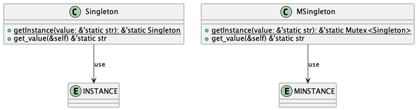

## Singleton

- 無闇矢鱈にインスタンスを生成させたくない。
- データを共通に扱いたい。

みたいなケースにインスタンスを生成しても参照するデータは一つで有ることを保証したいときに取るデザインパターン

## Singletonのクラス図

MSingletonが十分なSingletonだと思う。Mutexとか考えずに実装するとSingletonになるので履歴として残しておくことに

Rustはstructの中にstatic変数おけないためグローバル変数として宣言してそれをget_instanceでしか扱えないようにしている。グローバル変数と言ってもpubはつけていないので`singleton.rs`以外からのアクセスはできないためアクセスできるメソッドは`get_instance/get_value/set_value`に限定されている。

staticなデータは宣言する際に初期化する際[OnceCellの遅延初期化](https://docs.rs/once_cell/latest/once_cell/#lazy-initialized-global-data)を利用してget_instance時に初期化するかすでに存在する場合その値を既存の値を返すという処理をしている。

適当な値で初期化してget_instance時に上書きしたものを返すとかでも実装できるかもしれないけど、うーんget_instanceがすでに使われているかをちゃんとを参照カウントとか初期化フラグとか考えないとだめな気がするので、OnceCellを利用した実装のほうが良いはず
