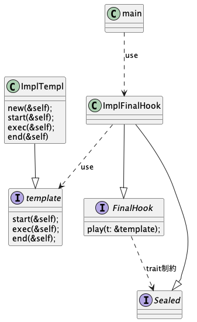

## Template method pattern

一連の流れはできているが各ステップで具体的にどう実装するかを個別の用途に委譲したい場合に利用できそう。
Pluginとかユニットテストとか、全体の処理は変わらないけど、一部の実装だけ複数欲しいとかに使えそう。
というかクラスと言う構造が一種のテンプレートパターンなのでは？

ただ愚直に実装すると、いわゆる全体の処理を定義するtemplate_methodのオーバーライドができない。(Javaならfinalが使えてオーバーライドが防げる)
## Rustでの実現方法
ユーザーにstart/exec/endの関数はオーバーライドしてほしいが、playは弄ってほしくない。
Rustではfinalのようなオーバーライド禁止をする機能はない。そのため分離したうえでいじらせたくない関数をSealed Patternで実装することでplayを持つtraitをuseはできるがImplはできないようにする。
そのplayに対して、関数をオーバーライドしたオブジェクトを渡せば実質Template method patternと同じアーキテクチャになりそう。

### Sealed Pattern

useはさせたいが、implはさせたくない機能を持つtraitに対して外部からアクセスできない`Sealed`traitをtrait制約にいれることで内部だけにしか実装できないようにするパターン

## Class図

ImplFinalHookはtempleオブジェクトを所有してもいいかもしれない。
